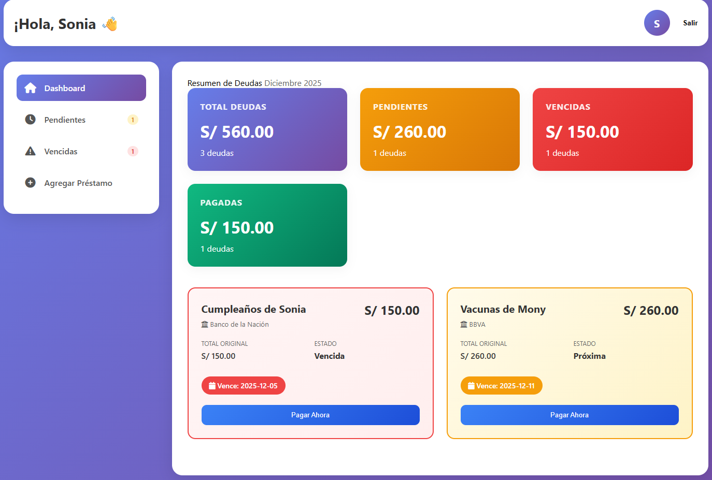

# 💰 Gestor Inteligente de Deudas


Un sistema web completo para la gestión financiera personal, diseñado para organizar, visualizar y alertar sobre deudas y pagos mensuales de manera intuitiva.

---

## 📸 Vistazo del Proyecto

<div align="center">
  
  <p><em>Dashboard con resumen financiero y alertas visuales</em></p>
</div>

---

## 🚀 Características Principales

1.  **Dashboard Informativo:** Visualización inmediata de deuda total, montos pendientes, vencidos y pagados.
2.  **Sistema de Semáforo:**
    * 🔴 **Rojo:** Deudas vencidas no pagadas.
    * 🟡 **Amarillo:** Deudas que vencen en la semana actual.
    * ⚪ **Normal:** Deudas al día o futuras.
3.  **Gestión de Pagos:** Registro de pagos parciales o totales con diferentes métodos (Transferencia, Efectivo, Tarjeta).
4.  **Cálculos Automáticos:** El sistema actualiza los saldos y estados de las deudas automáticamente mediante Triggers en la base de datos.
5.  **Historial y Notificaciones:** (En desarrollo) Alertas sobre vencimientos del día sin necesidad de entrar a la configuración profunda.

---

## 🛠️ Stack Tecnológico

* **Frontend:** HTML5, CSS3, JavaScript (ES6+), FontAwesome.
* **Backend:** Node.js, Express.js.
* **Base de Datos:** PostgreSQL con PL/pgSQL (Funciones y Triggers).
* **Seguridad:** JWT (JSON Web Tokens) para autenticación y Bcrypt para encriptación de contraseñas.

---

## ⚙️ Instalación y Configuración

Sigue estos pasos para ejecutar el proyecto en tu entorno local.

### 1. Prerrequisitos
* Tener instalado **Node.js** y **npm**.
* Tener instalado y corriendo **PostgreSQL**.

### 2. Configuración de la Base de Datos
1.  Crea una base de datos llamada `debt_manager`.
2.  Ejecuta el script SQL completo ubicado en `db/debt_manager_db_schema.sql`.
    * *Nota: Es crucial ejecutar todo el script para que se creen las tablas, triggers y la función de estadísticas.*

```
psql -U postgres -d debt_manager -f db/debt_manager_db_schema.sql
3. Configuración del Backend
Navega a la carpeta del servidor:


cd Grupo09_Pagos/backend
Instala las dependencias:


npm install
Crea un archivo .env en la carpeta backend con el siguiente contenido:

Fragmento de código

PGHOST=localhost
PGPORT=5432
PGDATABASE=debt_manager
PGUSER=postgres
PGPASSWORD=tu_contraseña_aqui
PORT=3000
JWT_SECRET=tu_clave_secreta_segura
Inicia el servidor:


npm run dev
Deberías ver: "Servidor escuchando en http://localhost:3000"

4. Ejecución del Frontend
Ve a la carpeta Grupo09_Pagos/frontend.

Abre el archivo login.html o index.html en tu navegador.

Recomendación: Usa una extensión como "Live Server" en VS Code para evitar problemas de CORS, aunque el código está adaptado para funcionar localmente.

📂 Estructura del Proyecto

Grupo09_Pagos/
├── backend/                # API REST (Node.js/Express)
│   ├── routes/             # Rutas de la API (Auth, Deudas, Pagos...)
│   ├── db.js               # Conexión a PostgreSQL
│   ├── auth.js             # Lógica de JWT y seguridad
│   └── server.js           # Punto de entrada del servidor
├── db/
│   └── debt_manager_db_schema.sql  # Script de creación de BD
├── frontend/               # Interfaz de Usuario
│   ├── index.html          # Dashboard principal
│   ├── login.html          # Inicio de sesión
│   ├── register.html       # Registro de usuarios
│   └── frontend_api_integration.js # Conexión con el Backend
└── README.md
🔗 Endpoints de la API
La API corre en http://localhost:3000/api y cuenta con los siguientes recursos principales:

Auth: /auth/login, /auth/register

Deudas: /debts (GET, POST, PUT, DELETE)

Pagos: /payments (POST para registrar pago, GET para historial)

Estadísticas: /statistics (Resumen financiero calculado en BD)

Bancos: /banks (Lista de entidades financieras)

📄 Licencia
Este proyecto es de uso académico/personal para el Grupo 09.


### Recomendación adicional:
Para que las imágenes se vean, crea una carpeta llamada `img` dentro de tu proyecto, guarda ahí tus captu